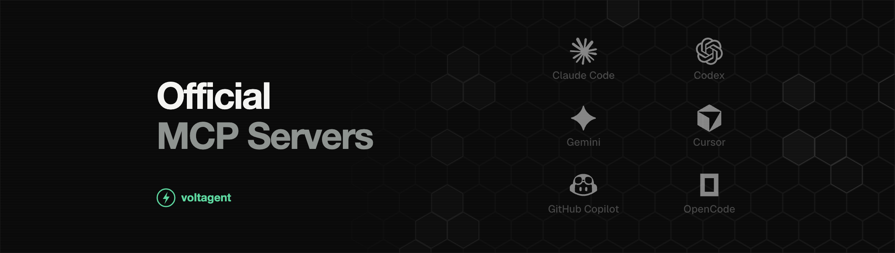

 

# Official MCP Servers

**The curated directory of official MCP servers.** 
**No unofficial forks, no abandoned projects, just servers you can trust.**

## What is MCP?

The Model Context Protocol (MCP) is an open standard that lets AI assistants connect to external tools and data. An MCP server exposes what a product can do (query a database, create a ticket, send an email), and any MCP client such as Claude, ChatGPT or Cursor can use it.

## Why this list matters

An MCP server can read your data and act on your behalf, so who built it matters. Every entry here is an official server from the company behind the product, or a widely used open source project. Where there is no public repository, we link the vendor's official MCP docs.

## Table of Contents

| [Cloud and DevOps](#cloud-and-devops) | [Databases](#databases-and-data) | [Observability](#observability-and-analytics) | [Browser and Web](#browser-automation-and-web-data) |
|---|---|---|---|
| [Search](#search-and-research) | [Developer Tools](#developer-tools) | [Security](#security-and-code-quality) | [Productivity](#productivity-and-project-management) |
| [Finance](#finance-and-payments) | [Messaging](#communication-and-messaging) | [AI and Media](#ai-media-and-data-visualization) | [Design](#design-and-collaboration) |
| [Travel](#travel-and-lifestyle) | [Marketing](#web-marketing-and-product) |  |  |

<h3 style="display:inline">Cloud and DevOps</h3>

- **[google/mcp](https://github.com/google/mcp)** - Google's collection of official MCP servers for Google and Google Cloud services
- **[cloudflare/mcp-server-cloudflare](https://github.com/cloudflare/mcp-server-cloudflare)** - Manage Workers, KV, R2, D1 and other Cloudflare services
- **[TencentCloudBase/CloudBase-AI-Toolkit](https://github.com/TencentCloudBase/CloudBase-AI-Toolkit)** - Build and deploy full-stack apps on Tencent CloudBase
- **[vercel/next-devtools-mcp](https://github.com/vercel/next-devtools-mcp)** - Next.js development tools, docs and runtime diagnostics for coding agents
- **[GoogleCloudPlatform/cloud-run-mcp](https://github.com/GoogleCloudPlatform/cloud-run-mcp)** - Deploy apps to Google Cloud Run from your AI assistant
- **[TencentEdgeOne/edgeone-makers-mcp](https://github.com/TencentEdgeOne/edgeone-makers-mcp)** - Deploy HTML and sites to Tencent EdgeOne Pages
- **[aliyun/alibabacloud-devops-mcp-server](https://github.com/aliyun/alibabacloud-devops-mcp-server)** - Alibaba Cloud DevOps (Yunxiao) projects, code and pipelines
- **[hostinger/api-mcp-server](https://github.com/hostinger/api-mcp-server)** - Manage Hostinger hosting, domains and VPS through the API
- **[harness/mcp-server](https://github.com/harness/mcp-server)** - Work with Harness pipelines, services and environments
- **[CircleCI-Public/mcp-server-circleci](https://github.com/CircleCI-Public/mcp-server-circleci)** - Debug failed builds and manage CircleCI pipelines
- **[netlify/netlify-mcp](https://github.com/netlify/netlify-mcp)** - Create, build and deploy sites on Netlify
- **[buildkite/buildkite-mcp-server](https://github.com/buildkite/buildkite-mcp-server)** - Inspect Buildkite pipelines, builds and logs
- **[Tencent/cos-mcp](https://github.com/Tencent/cos-mcp)** - Tencent Cloud COS object storage and data processing
- **[Aiven-Open/mcp-aiven](https://github.com/Aiven-Open/mcp-aiven)** - Navigate Aiven projects and manage PostgreSQL, Kafka, ClickHouse and OpenSearch
- **[Vercel](https://vercel.com/docs/mcp/vercel-mcp)** - Manage Vercel projects and deployments ([Claude](https://claude.com/marketplace/connectors/vercel))
- **[Supabase](https://github.com/supabase/mcp)** - Manage Supabase projects, databases and edge functions ([Claude](https://claude.com/marketplace/connectors/supabase))
- **[Firebase](https://firebase.google.com/docs/ai-assistance/mcp-server)** - Firebase tools and docs for AI assistants
- **[Azure](https://github.com/microsoft/mcp)** - Microsoft's MCP servers including Azure MCP Server
- **[Terraform](https://github.com/hashicorp/terraform-mcp-server)** - Terraform registry and workspace tools
- **[Docker MCP Toolkit](https://github.com/docker/mcp-gateway)** - Docker's MCP gateway for running MCP servers in containers
- **[Railway](https://docs.railway.com/ai/mcp-server)** - Deploy and manage Railway projects ([Claude](https://claude.com/marketplace/connectors/railway))
- **[Octopus Deploy](https://github.com/OctopusDeploy/mcp-server)** - Octopus Deploy releases and deployments
- **[GitLab](https://docs.gitlab.com/user/model_context_protocol/mcp_server/)** - GitLab projects, issues and merge requests
- **[AWS CloudTrail](https://github.com/awslabs/mcp/tree/main/src/cloudtrail-mcp-server)** - Query CloudTrail events and Lake for audits
- **[Google Compute Engine](https://docs.cloud.google.com/compute/docs/use-compute-engine-mcp)** - Manage VMs, disks and snapshots on Compute Engine ([Claude](https://claude.com/marketplace/connectors/google-compute-engine))
- **[Cloudflare Code Mode](https://github.com/cloudflare/mcp)** - Entire Cloudflare API through search and execute tools
- **[Docker Hub](https://github.com/docker/hub-mcp)** - Search Docker Hub repositories and images
- **[Alibaba Cloud Ops](https://github.com/aliyun/alibaba-cloud-ops-mcp-server)** - Operate Alibaba Cloud resources like ECS and monitoring
- **[Azure DevOps](https://github.com/microsoft/azure-devops-mcp)** - Azure DevOps repos, work items and pipelines
- **[Radar](https://github.com/skyhook-io/radar)** - Inspect, troubleshoot and operate Kubernetes clusters

- **[Easypanel](https://easypanel.io/docs/mcp)** - Manage self-hosted applications and databases via Easypanel’s built-in MCP

<h3 style="display:inline">Databases and Data</h3>

- **[googleapis/mcp-toolbox](https://github.com/googleapis/mcp-toolbox)** - MCP Toolbox for Databases by Google, connecting agents to SQL and NoSQL stores
- **[instantdb/instant](https://github.com/instantdb/instant)** - Realtime backend and database for apps, with an MCP server
- **[timescale/pg-aiguide](https://github.com/timescale/pg-aiguide)** - Postgres best practices and docs for AI coding tools
- **[neo4j-contrib/mcp-neo4j](https://github.com/neo4j-contrib/mcp-neo4j)** - Neo4j graph database queries and schema tools
- **[ClickHouse/mcp-clickhouse](https://github.com/ClickHouse/mcp-clickhouse)** - Run analytical queries on ClickHouse
- **[neondatabase/mcp-server-neon](https://github.com/neondatabase/mcp-server-neon)** - Manage Neon serverless Postgres projects and branches
- **[dbt-labs/dbt-mcp](https://github.com/dbt-labs/dbt-mcp)** - Expose dbt models, metrics and the semantic layer to agents
- **[chroma-core/chroma-mcp](https://github.com/chroma-core/chroma-mcp)** - Vector search and collections on Chroma
- **[motherduckdb/mcp-server-motherduck](https://github.com/motherduckdb/mcp-server-motherduck)** - Query DuckDB and MotherDuck
- **[apache/doris-mcp-server](https://github.com/apache/doris-mcp-server)** - Query and manage Apache Doris
- **[zilliztech/mcp-server-milvus](https://github.com/zilliztech/mcp-server-milvus)** - Vector search on Milvus
- **[meilisearch/meilisearch-mcp](https://github.com/meilisearch/meilisearch-mcp)** - Manage Meilisearch indexes and run searches
- **[StarRocks/mcp-server-starrocks](https://github.com/StarRocks/mcp-server-starrocks)** - Query StarRocks analytics databases
- **[tinybirdco/mcp-tinybird](https://github.com/tinybirdco/mcp-tinybird)** - Query Tinybird data sources and endpoints
- **[Teradata/teradata-mcp-server](https://github.com/Teradata/teradata-mcp-server)** - Teradata data and analytics tools
- **[Unstructured-IO/UNS-MCP](https://github.com/Unstructured-IO/UNS-MCP)** - Process and ingest unstructured documents with Unstructured
- **[couchbase/mcp-server-couchbase](https://github.com/couchbase/mcp-server-couchbase)** - Query and manage Couchbase clusters
- **[singlestore-labs/mcp-server-singlestore](https://github.com/singlestore-labs/mcp-server-singlestore)** - Interact with SingleStore databases and workspaces
- **[GreptimeTeam/greptimedb-mcp-server](https://github.com/GreptimeTeam/greptimedb-mcp-server)** - Query GreptimeDB time series data
- **[PlanetScale](https://planetscale.com/docs/connect/mcp)** - Query and manage PlanetScale databases ([Claude](https://claude.com/marketplace/connectors/planetscale))
- **[Xata](https://github.com/xataio/mcp)** - Xata Postgres databases
- **[Qdrant](https://github.com/qdrant/mcp-server-qdrant)** - Vector search with Qdrant
- **[Oracle](https://github.com/oracle/mcp)** - Oracle's official MCP servers
- **[Airtable](https://support.airtable.com/articles/9897799762-using-the-airtable-mcp-server)** - Official Airtable MCP server for bases and records ([Claude](https://claude.com/marketplace/connectors/airtable))
- **[Kaggle](https://www.kaggle.com/docs/mcp)** - Notebooks, competitions, datasets and models on Kaggle
- **[AWS DynamoDB](https://github.com/awslabs/mcp/tree/main/src/dynamodb-mcp-server)** - DynamoDB data modeling guidance and validation
- **[Google Cloud BigQuery](https://github.com/GoogleCloudPlatform/bigquery-remote-mcp)** - Run BigQuery queries and inspect metadata
- **[Metabase](https://www.metabase.com/docs/latest/ai/overview)** - Built-in MCP to search, query, visualize Metabase data ([Claude](https://claude.com/marketplace/connectors/metabase))
- **[Hex](https://learn.hex.tech/docs/api-integrations/mcp-server)** - Reason over Hex data projects and notebooks ([Claude](https://claude.com/marketplace/connectors/hex))
- **[Elasticsearch](https://www.elastic.co/docs/explore-analyze/ai-features/agent-builder/mcp-server)** - Query Elasticsearch data through the Elastic Agent Builder MCP endpoint
- **[Apache IoTDB](https://github.com/apache/iotdb-mcp-server)** - Query and manage Apache IoTDB time series data
- **[Pinecone Assistant](https://github.com/pinecone-io/assistant-mcp)** - Retrieve context from a Pinecone Assistant
- **[Prisma](https://github.com/prisma/prisma)** - Manage Prisma databases and migrations from AI assistants
- **[Convex](https://github.com/get-convex/convex-backend)** - Inspect and query Convex reactive databases
- **[MongoDB](https://github.com/mongodb-js/mongodb-mcp-server)** - Connect to MongoDB databases and Atlas
- **[Redis](https://github.com/redis/mcp-redis)** - Natural language interface for Redis data
- **[Snowflake](https://github.com/Snowflake-Labs/mcp)** - Snowflake Cortex AI and object management

<h3 style="display:inline">Observability and Analytics</h3>

- **[jitsucom/jitsu](https://github.com/jitsucom/jitsu)** - Open source data ingestion and event collection platform
- **[grafana/mcp-grafana](https://github.com/grafana/mcp-grafana)** - Search dashboards, query datasources and investigate incidents in Grafana
- **[comet-ml/opik-mcp](https://github.com/comet-ml/opik-mcp)** - Comet Opik LLM observability and evaluation
- **[initMAX/zabbix-mcp-server](https://github.com/initMAX/zabbix-mcp-server)** - Zabbix monitoring: hosts, triggers and problems
- **[langfuse/mcp-server-langfuse](https://github.com/langfuse/mcp-server-langfuse)** - Access Langfuse prompt management
- **[pydantic/logfire-mcp](https://github.com/pydantic/logfire-mcp)** - Query traces and metrics from Pydantic Logfire
- **[PostHog/mcp](https://github.com/PostHog/mcp)** - Product analytics, feature flags and error tracking from PostHog
- **[axiomhq/mcp-server-axiom](https://github.com/axiomhq/mcp-server-axiom)** - Query logs and traces in Axiom
- **[incident-io/incidentio-mcp-golang](https://github.com/incident-io/incidentio-mcp-golang)** - Manage incidents in incident.io
- **[instana/mcp-instana](https://github.com/instana/mcp-instana)** - IBM Instana application performance monitoring
- **[Sentry](https://github.com/getsentry/sentry-mcp)** - Inspect Sentry issues and errors ([Claude](https://claude.com/marketplace/connectors/sentry))
- **[PagerDuty](https://developer.pagerduty.com/docs/mcp-tooling-remote-server)** - Incidents, services and on-call from PagerDuty ([Claude](https://claude.com/marketplace/connectors/pagerduty))
- **[Amplitude](https://amplitude.com/docs/amplitude-ai/amplitude-mcp)** - Product analytics charts, cohorts, experiments via natural language ([Claude](https://claude.com/marketplace/connectors/amplitude))
- **[Mixpanel](https://docs.mixpanel.com/docs/mcp)** - Query events, funnels, retention, and replays in Mixpanel ([Claude](https://claude.com/marketplace/connectors/mixpanel))
- **[Pendo](https://support.pendo.io/hc/en-us/articles/41102236924955-Connect-to-the-Pendo-MCP-server)** - Product usage, visitor, and account analytics from Pendo ([Claude](https://claude.com/marketplace/connectors/pendo))
- **[Monte Carlo](https://docs.getmontecarlo.com/docs/monte-carlo-mcp-server-technical-overview)** - Data and AI observability, monitors, lineage, alerts ([Claude](https://claude.com/marketplace/connectors/monte-carlo))
- **[Contentsquare](https://contentsquare.com/platform/capabilities/mcp-server/)** - Session replay, rage clicks, funnels from Contentsquare ([Claude](https://claude.com/marketplace/connectors/contentsquare))
- **[Netdata](https://github.com/netdata/netdata/blob/master/src/web/mcp/README.md)** - Infrastructure monitoring and root cause analysis with Netdata
- **[VictoriaMetrics](https://github.com/VictoriaMetrics/mcp-victoriametrics)** - Query VictoriaMetrics instances and read its docs
- **[Arize Phoenix](https://github.com/Arize-ai/phoenix)** - LLM observability and evaluation with Phoenix
- **[Google Analytics](https://github.com/googleanalytics/google-analytics-mcp)** - Query Google Analytics reports and properties

<h3 style="display:inline">Browser Automation and Web Data</h3>

- **[trycua/cua](https://github.com/trycua/cua)** - Infrastructure for computer-use agents
- **[Skyvern-AI/skyvern](https://github.com/Skyvern-AI/skyvern)** - Automate browser workflows with LLMs and computer vision
- **[browserbase/mcp-server-browserbase](https://github.com/browserbase/mcp-server-browserbase)** - Cloud browser sessions and automation with Browserbase
- **[brightdata/brightdata-mcp](https://github.com/brightdata/brightdata-mcp)** - Web access, scraping and unblocking with Bright Data
- **[hyperbrowserai/mcp](https://github.com/hyperbrowserai/mcp)** - Scrape, crawl and automate browsers with Hyperbrowser
- **[mozilla/firefox-devtools-mcp](https://github.com/mozilla/firefox-devtools-mcp)** - Control and debug Firefox through DevTools
- **[tinyfish-io/agentql-mcp](https://github.com/tinyfish-io/agentql-mcp)** - Extract structured data from the web with AgentQL
- **[scrapeless-ai/scrapeless-mcp-server](https://github.com/scrapeless-ai/scrapeless-mcp-server)** - Scraping and browser automation with Scrapeless
- **[browserstack/mcp-server](https://github.com/browserstack/mcp-server)** - Test on real browsers and devices with BrowserStack
- **[oxylabs/oxylabs-mcp](https://github.com/oxylabs/oxylabs-mcp)** - Web scraping through Oxylabs
- **[screenshotone/mcp](https://github.com/screenshotone/mcp)** - Render website screenshots with ScreenshotOne
- **[Decodo/mcp-server](https://github.com/Decodo/mcp-server)** - Web scraping and proxy tools from Decodo
- **[Apify](https://github.com/apify/apify-mcp-server)** - Run Apify Actors for scraping and automation ([Claude](https://claude.com/marketplace/connectors/apify))
- **[Firecrawl](https://github.com/firecrawl/firecrawl-mcp-server)** - Scrape and crawl websites with Firecrawl ([Claude](https://claude.com/marketplace/connectors/firecrawl))
- **[Chrome DevTools](https://github.com/ChromeDevTools/chrome-devtools-mcp)** - Control and inspect Chrome with DevTools
- **[Playwright](https://github.com/microsoft/playwright-mcp)** - Browser automation with Playwright
- **[Scrapfly](https://github.com/scrapfly/scrapfly-mcp)** - Web scraping and data extraction via Scrapfly

<h3 style="display:inline">Search and Research</h3>

- **[exa-labs/exa-mcp-server](https://github.com/exa-labs/exa-mcp-server)** - AI web search and code context with Exa
- **[ref-tools/ref-tools-mcp](https://github.com/ref-tools/ref-tools-mcp)** - Up to date docs search for coding agents
- **[kagisearch/kagimcp](https://github.com/kagisearch/kagimcp)** - Search the web with Kagi
- **[serpapi/serpapi-mcp](https://github.com/serpapi/serpapi-mcp)** - Search engine results through SerpApi
- **[Tavily](https://github.com/tavily-ai/tavily-mcp)** - Web search and extraction with Tavily ([Claude](https://claude.com/marketplace/connectors/tavily))
- **[Perplexity](https://github.com/perplexityai/modelcontextprotocol)** - Web search with Perplexity
- **[Parallel Search](https://github.com/parallel-web/search-mcp)** - Web search for AI agents via Parallel ([Claude](https://claude.com/marketplace/connectors/parallel-search))
- **[Brave Search](https://github.com/brave/brave-search-mcp-server)** - Web, local and image search with Brave
- **[Jina AI](https://github.com/jina-ai/MCP)** - Search, read and embed the web with Jina AI

<h3 style="display:inline">Developer Tools</h3>

- **[21st-dev/magic-mcp](https://github.com/21st-dev/magic-mcp)** - Generate UI components from natural language with 21st.dev Magic
- **[lingodotdev/lingo.dev](https://github.com/lingodotdev/lingo.dev)** - AI localization toolkit and MCP server
- **[JetBrains/mcp-jetbrains](https://github.com/JetBrains/mcp-jetbrains)** - Drive JetBrains IDEs from MCP clients
- **[gitkraken/gk-cli](https://github.com/gitkraken/gk-cli)** - GitKraken CLI with a built-in MCP server for Git and issue tracking
- **[e2b-dev/mcp-server](https://github.com/e2b-dev/mcp-server)** - Run code in secure E2B sandboxes
- **[sveltejs/ai-tools](https://github.com/sveltejs/ai-tools)** - Official Svelte docs and tooling for AI assistants
- **[postmanlabs/postman-mcp-server](https://github.com/postmanlabs/postman-mcp-server)** - Work with Postman collections, workspaces and APIs
- **[jamsocket/forevervm](https://github.com/jamsocket/forevervm)** - Run stateful code in persistent ForeverVM sandboxes
- **[oschina/mcp-gitee](https://github.com/oschina/mcp-gitee)** - Manage Gitee repositories, issues and pull requests
- **[GitHub](https://github.com/github/github-mcp-server)** - GitHub's official MCP server for repos, issues and pull requests
- **[Context7](https://github.com/upstash/context7)** - Up to date library docs for coding agents ([Claude](https://claude.com/marketplace/connectors/context7))
- **[Hugging Face](https://github.com/huggingface/hf-mcp-server)** - Hugging Face Hub models, datasets and Spaces ([Claude](https://claude.com/marketplace/connectors/hugging-face))
- **[Storybook](https://storybook.js.org/docs/ai/mcp/overview)** - Storybook component docs for AI agents
- **[Stack Overflow](https://github.com/StackExchange/Stack-MCP)** - Stack Overflow knowledge for AI assistants ([Claude](https://claude.com/marketplace/connectors/stack-overflow))
- **[MDN](https://github.com/mdn/mcp)** - MDN Web Docs for AI assistants ([Claude](https://claude.com/marketplace/connectors/mdn))
- **[Mintlify](https://www.mintlify.com/docs/ai/model-context-protocol)** - Search docs hosted on Mintlify ([Claude](https://claude.com/marketplace/connectors/mintlify))
- **[Clerk](https://clerk.com/docs/guides/ai/mcp/clerk-mcp-server)** - Clerk authentication SDK snippets and docs ([Claude](https://claude.com/marketplace/connectors/clerk))
- **[Stytch](https://stytch.com/docs/resources/workspace-management/stytch-mcp-server)** - Manage Stytch auth workspaces ([Claude](https://claude.com/marketplace/connectors/stytch))
- **[Salesforce DX](https://github.com/salesforcecli/mcp)** - Salesforce DX tools for orgs and metadata
- **[OpenZeppelin](https://github.com/OpenZeppelin/openzeppelin-mcp)** - MCP servers for OpenZeppelin smart contract products
- **[Laravel Boost](https://github.com/laravel/boost)** - Laravel app context and tools for AI agents
- **[ConfigCat](https://github.com/configcat/mcp-server)** - Manage ConfigCat feature flags and settings
- **[DevCycle](https://github.com/DevCycleHQ/cli)** - Create and manage DevCycle feature flags
- **[Alchemy](https://github.com/alchemyplatform/alchemy-mcp-server)** - Blockchain APIs from Alchemy
- **[MCP Reference Servers](https://github.com/modelcontextprotocol/servers)** - Official reference servers: filesystem, fetch, git, memory and more
- **[Microsoft Learn](https://github.com/MicrosoftDocs/mcp)** - Search official Microsoft Learn documentation
- **[Apollo GraphQL](https://github.com/apollographql/apollo-mcp-server)** - Expose GraphQL APIs as MCP tools

<h3 style="display:inline">Security and Code Quality</h3>

- **[semgrep/mcp](https://github.com/semgrep/mcp)** - Scan code for security issues with Semgrep
- **[SonarSource/sonarqube-mcp-server](https://github.com/SonarSource/sonarqube-mcp-server)** - SonarQube code quality and security analysis
- **[cycodehq/cycode-cli](https://github.com/cycodehq/cycode-cli)** - Cycode application security scanning
- **[1Password](https://www.1password.dev/environments/mcp-server)** - Manage 1Password Environments without exposing secrets
- **[Malwarebytes](https://claude.com/marketplace/connectors/malwarebytes)** - Scam checks for links, emails and phone numbers
- **[Snyk](https://github.com/snyk/studio-mcp)** - Snyk security scanning inside agentic workflows
- **[Bitwarden](https://github.com/bitwarden/mcp-server)** - Interact with Bitwarden vaults
- **[CrowdStrike](https://github.com/CrowdStrike/falcon-mcp)** - Connect agents to CrowdStrike Falcon for security operations

<h3 style="display:inline">Productivity and Project Management</h3>

- **[elie222/inbox-zero](https://github.com/elie222/inbox-zero)** - Open source AI email assistant
- **[Doist/todoist-mcp](https://github.com/Doist/todoist-mcp)** - Manage Todoist tasks and projects
- **[ankimcp/anki-mcp-server](https://github.com/ankimcp/anki-mcp-server)** - Create and review Anki flashcards
- **[makeplane/plane-mcp-server](https://github.com/makeplane/plane-mcp-server)** - Plane projects, issues and cycles
- **[integromat/make-mcp-server](https://github.com/integromat/make-mcp-server)** - Run Make automation scenarios as tools
- **[taskade/mcp](https://github.com/taskade/mcp)** - Taskade projects, tasks and agents
- **[its-dart/dart-mcp-server](https://github.com/its-dart/dart-mcp-server)** - Dart project and task management
- **[box-community/mcp-server-box](https://github.com/box-community/mcp-server-box)** - Search and manage content in Box
- **[atlassian/trello-mcp-server](https://github.com/atlassian/trello-mcp-server)** - Trello boards and cards
- **[Asana](https://developers.asana.com/docs/using-asanas-mcp-server)** - Official Asana MCP server for tasks and projects ([Claude](https://claude.com/marketplace/connectors/asana))
- **[ClickUp](https://help.clickup.com/hc/en-us/articles/33335772678423-What-is-ClickUp-MCP)** - Official ClickUp MCP server for tasks and docs ([Claude](https://claude.com/marketplace/connectors/clickup))
- **[Calendly](https://developer.calendly.com/calendly-mcp-server)** - Hosted Calendly MCP server for scheduling ([Claude](https://claude.com/marketplace/connectors/calendly))
- **[Cal.com](https://github.com/calcom/cal-mcp)** - Official Cal.com MCP server for scheduling
- **[Granola](https://docs.granola.ai/help-center/sharing/integrations/mcp)** - Granola MCP to query meeting notes and transcripts ([Claude](https://claude.com/marketplace/connectors/granola))
- **[Readwise](https://github.com/readwiseio/readwise-mcp)** - Readwise MCP for highlights and saved reading ([Claude](https://claude.com/marketplace/connectors/readwise))
- **[Docusign](https://developers.docusign.com/platform/mcp-server/)** - Hosted Docusign MCP server for agreements and e-signature ([Claude](https://claude.com/marketplace/connectors/docusign))
- **[SignNow](https://docs.signnow.com/docs/signnow/mcp-server)** - SignNow MCP server for e-signature documents and invites ([Claude](https://claude.com/marketplace/connectors/signnow))
- **[DocuSeal](https://www.docuseal.com/guides/integrate-with-ai-agents-using-mcp)** - DocuSeal MCP for templates, submissions, and e-signing ([Claude](https://claude.com/marketplace/connectors/docuseal))
- **[IFTTT](https://help.ifttt.com/hc/en-us/articles/47690989390619-Using-IFTTT-with-AI-Assistants)** - IFTTT MCP to trigger applets and automations ([Claude](https://claude.com/marketplace/connectors/ifttt))
- **[Udemy Business](https://business-support.udemy.com/hc/en-us/articles/34213384429335-How-to-Integrate-the-Udemy-Business-MCP-Server-With-Your-AI-Tool)** - Search courses and surface learning content ([Claude](https://claude.com/marketplace/connectors/udemy-business))
- **[Craft](https://support.craft.do/en/integrate/mcp)** - Notes, docs and tasks via Craft remote MCP ([Claude](https://claude.com/marketplace/connectors/craft))
- **[Pipedream](https://github.com/PipedreamHQ/pipedream)** - Connect thousands of apps and APIs through Pipedream

<h3 style="display:inline">Finance and Payments</h3>

- **[financial-datasets/mcp-server](https://github.com/financial-datasets/mcp-server)** - Stock market and financial statement data
- **[XeroAPI/xero-mcp-server](https://github.com/XeroAPI/xero-mcp-server)** - Xero accounting
- **[paypal/agent-toolkit](https://github.com/paypal/agent-toolkit)** - PayPal payments and commerce tools for agents
- **[square/square-mcp-server](https://github.com/square/square-mcp-server)** - Square payments, catalog and orders
- **[twelvedata/mcp](https://github.com/twelvedata/mcp)** - Twelve Data market data
- **[ramp-public/ramp_mcp](https://github.com/ramp-public/ramp_mcp)** - Ramp spend management data
- **[chargebee/agentkit](https://github.com/chargebee/agentkit)** - Chargebee subscription billing tools
- **[Stripe](https://github.com/stripe/ai)** - Stripe AI toolkit including the MCP server ([Claude](https://claude.com/marketplace/connectors/stripe))
- **[Plaid](https://plaid.com/docs/resources/mcp/)** - Debug Items and view Link analytics via Dashboard MCP ([Claude](https://claude.com/marketplace/connectors/plaid))
- **[Razorpay](https://github.com/razorpay/razorpay-mcp-server)** - Official Razorpay payments API MCP server ([Claude](https://claude.com/marketplace/connectors/razorpay))
- **[GoCardless](https://developer.gocardless.com/developer-tools/mcp/)** - Bank payments API docs and integration help ([Claude](https://claude.com/marketplace/connectors/gocardless))
- **[Brex](https://developer.brex.com/docs/mcp)** - Manage expenses, cards, and transactions in Brex ([Claude](https://claude.com/marketplace/connectors/brex))
- **[Mercury](https://docs.mercury.com/docs/connecting-mercury-mcp)** - Read-only business banking accounts, transactions, and treasury ([Claude](https://claude.com/marketplace/connectors/mercury))
- **[Ramp Data](https://docs.ramp.com/developer-api/v1/ramp-mcp)** - Query Ramp spend data and take actions ([Claude](https://claude.com/marketplace/connectors/ramp-data))
- **[QuickBooks](https://github.com/intuit/quickbooks-online-mcp-server)** - Access QuickBooks Online accounting data and reports ([Claude](https://claude.com/marketplace/connectors/quickbooks))
- **[Gusto](https://docs.gusto.com/app-integrations/docs/mcp)** - Payroll, time-off, and workforce data from Gusto ([Claude](https://claude.com/marketplace/connectors/gusto))
- **[Cash App](https://claude.com/marketplace/connectors/cash-app)** - Order by Cash App restaurant discovery and checkout
- **[Crypto.com](https://mcp.crypto.com/docs)** - Real-time crypto prices, order books, and market data ([Claude](https://claude.com/marketplace/connectors/crypto-com))
- **[IBKR](https://www.interactivebrokers.com/en/trading/ai-integrations.php)** - Analyze IBKR portfolio, positions, and risk with AI ([Claude](https://claude.com/marketplace/connectors/interactive-brokers))
- **[FactSet](https://developer.factset.com/mcp/factset-ai-ready-data-mcp)** - FactSet fundamentals, estimates, prices, and ownership data ([Claude](https://claude.com/marketplace/connectors/factset))
- **[PitchBook](https://claude.com/marketplace/connectors/pitchbook)** - Private market deals, investors, and company profiles
- **[Morningstar](https://developer.morningstar.com/direct-web-services/documentation/mcp-server/morningstar-mcp-server)** - Morningstar analyst research and investment data ([Claude](https://claude.com/marketplace/connectors/morningstar))
- **[S&P Global](https://docs.kensho.com/llmreadyapi/mcp)** - S&P Capital IQ financial data via Kensho ([Claude](https://claude.com/marketplace/connectors/s-p-global))
- **[LSEG](https://www.lseg.com/en/solutions/ai-finance-solutions/lseg-mcp)** - LSEG analytics, fundamentals, macro data, and Reuters news ([Claude](https://claude.com/marketplace/connectors/london-stock-exchange-group))
- **[MSCI](https://www.msci.com/data-and-analytics/private-asset-solutions/ai-for-private-markets/private-assets-ai-connector)** - MSCI index, risk, and private assets data ([Claude](https://claude.com/marketplace/connectors/msci))
- **[Moody's](https://www.moodys.com/web/en/us/genai/model-context-protocol.html)** - Credit ratings and research via Moody's GenAI data ([Claude](https://claude.com/marketplace/connectors/moodys-analytics))
- **[Carta](https://claude.com/marketplace/connectors/carta)** - Cap table, investor, and fund data from Carta
- **[Alpaca](https://github.com/alpacahq/alpaca-mcp-server)** - Trade stocks, ETFs and crypto through Alpaca

<h3 style="display:inline">Communication and Messaging</h3>

- **[line/line-bot-mcp-server](https://github.com/line/line-bot-mcp-server)** - Send messages through a LINE Official Account
- **[twilio-labs/mcp](https://github.com/twilio-labs/mcp)** - Twilio messaging and voice APIs
- **[mailtrap/mailtrap-mcp](https://github.com/mailtrap/mailtrap-mcp)** - Send and test email with Mailtrap
- **[mailgun/mailgun-mcp-server](https://github.com/mailgun/mailgun-mcp-server)** - Send and track email with Mailgun
- **[infobip/mcp](https://github.com/infobip/mcp)** - Infobip messaging and communication channels
- **[Zoom](https://developers.zoom.us/docs/mcp/)** - Official Zoom MCP servers for meetings, chat, and docs
- **[Fireflies](https://docs.fireflies.ai/getting-started/mcp-configuration)** - Hosted Fireflies MCP for meeting transcripts and summaries ([Claude](https://claude.com/marketplace/connectors/fireflies))
- **[Otter.ai](https://help.otter.ai/hc/en-us/articles/35287607569687-Otter-MCP-Server)** - Otter MCP server for meeting transcripts and insights ([Claude](https://claude.com/marketplace/connectors/otter-ai))
- **[Fathom](https://developers.fathom.ai/mcp-docs)** - Official Fathom MCP for meeting recordings and summaries ([Claude](https://claude.com/marketplace/connectors/fathom))
- **[Intercom](https://github.com/intercom/intercom-mcp-server)** - Intercom MCP docs for conversations and contacts ([Claude](https://claude.com/marketplace/connectors/intercom))
- **[Resend](https://github.com/resend/resend-mcp)** - Official Resend MCP server for sending emails ([Claude](https://claude.com/marketplace/connectors/resend))
- **[Elastic Email](https://github.com/ElasticEmail/elasticemail-mcp-server)** - Send emails, manage contacts, lists and campaigns
- **[MailerSend](https://developers.mailersend.com/mcp)** - Send transactional email and SMS, manage domains

<h3 style="display:inline">AI, Media and Data Visualization</h3>

- **[mastra-ai/mastra](https://github.com/mastra-ai/mastra)** - TypeScript agent framework with MCP support
- **[antvis/mcp-server-chart](https://github.com/antvis/mcp-server-chart)** - Generate charts with AntV
- **[matlab/matlab-mcp-server](https://github.com/matlab/matlab-mcp-server)** - Run MATLAB code from AI assistants
- **[elevenlabs/elevenlabs-mcp](https://github.com/elevenlabs/elevenlabs-mcp)** - Text to speech and voice tools from ElevenLabs
- **[SkyworkAI/Mureka-mcp](https://github.com/SkyworkAI/Mureka-mcp)** - Generate music with Mureka
- **[zenml-io/mcp-zenml](https://github.com/zenml-io/mcp-zenml)** - Inspect ZenML pipelines and runs
- **[video-db/agent-toolkit](https://github.com/video-db/agent-toolkit)** - Video search and editing with VideoDB
- **[cloudinary/mcp-servers](https://github.com/cloudinary/mcp-servers)** - Cloudinary media management and transformation
- **[OpenRouter](https://openrouter.ai/docs/guides/overview/mcp-server)** - Access models through OpenRouter
- **[MiniMax](https://github.com/MiniMax-AI/MiniMax-MCP)** - Text-to-speech, image and video generation APIs
- **[Adobe for creativity](https://claude.com/marketplace/connectors/adobe-creativity)** - Photoshop, Express and Firefly tools inside Claude
- **[Lottie Creator](https://docs.lottiefiles.com/en/creator/13_ai-tools/lottie-creator-mcp)** - Build and edit Lottie animations with AI
- **[Rive](https://rive.app/docs/editor/ai/mcp)** - Control the Rive editor and animations via MCP
- **[Picsart](https://github.com/PicsArt/picsart-mcp-cli-docs)** - Generate images, video and audio across many models
- **[Blender MCP](https://github.com/ahujasid/blender-mcp)** - Control Blender 3D scenes from AI assistants
- **[VoltAgent](https://github.com/VoltAgent/voltagent/tree/main/packages/mcp-server)** - Expose VoltAgent agents, tools and workflows via MCP
- **[Lara Translate](https://github.com/translated/lara-mcp)** - Professional translation with glossaries and memories
- **[Microsoft MarkItDown](https://github.com/microsoft/markitdown/tree/main/packages/markitdown-mcp)** - Convert files and documents to Markdown for LLMs
- **[Screenpipe](https://github.com/screenpipe/screenpipe)** - Local screen and audio capture indexed for AI
- **[Vizro](https://github.com/mckinsey/vizro/tree/main/vizro-mcp)** - Build validated charts and dashboards with Vizro
- **[Tableau](https://github.com/tableau/tableau-mcp)** - Let agents explore and query Tableau data
- **[Docling](https://github.com/docling-project/docling-mcp)** - Document conversion and processing with Docling

<h3 style="display:inline">Design and Collaboration</h3>

- **[Figma](https://github.com/figma/mcp-server-guide)** - Figma design context for code generation ([Claude](https://claude.com/marketplace/connectors/figma))
- **[Canva](https://www.canva.dev/docs/apps/mcp/)** - Create and edit Canva designs ([Claude](https://claude.com/marketplace/connectors/canva))
- **[Miro](https://claude.com/marketplace/connectors/miro)** - Miro boards and diagrams
- **[Notion](https://github.com/makenotion/notion-mcp-server)** - Notion pages and databases ([Claude](https://claude.com/marketplace/connectors/notion))
- **[Linear](https://linear.app/docs/mcp)** - Linear issues and projects ([Claude](https://claude.com/marketplace/connectors/linear))
- **[Atlassian](https://github.com/atlassian/atlassian-mcp-server)** - Jira and Confluence from Atlassian ([Claude](https://claude.com/marketplace/connectors/atlassian))
- **[Slack](https://docs.slack.dev/ai/mcp-server)** - Slack messages and channels ([Claude](https://claude.com/marketplace/connectors/slack))
- **[Gamma](https://developers.gamma.app/)** - Generate decks, docs and sites with Gamma ([Claude](https://claude.com/marketplace/connectors/gamma))
- **[Excalidraw](https://github.com/excalidraw/excalidraw-mcp)** - Streamable Excalidraw MCP app for hand-drawn diagrams
- **[tldraw](https://github.com/tldraw/tldraw/tree/main/apps/mcp-app)** - Interactive tldraw canvas for AI agents ([Claude](https://claude.com/marketplace/connectors/tldraw))
- **[Lucid](https://github.com/lucidsoftware/lucid-mcp-server)** - Create and search Lucid diagrams from AI
- **[Whimsical](https://github.com/WhimsicalCode/mcp-server-guide)** - Boards, flowcharts and wireframes in Whimsical workspaces ([Claude](https://claude.com/marketplace/connectors/whimsical))
- **[Mermaid Chart](https://mermaid.ai/docs/ai/mcp-server)** - Validate, render and manage Mermaid diagrams ([Claude](https://claude.com/marketplace/connectors/mermaid-chart))
- **[Icons8](https://github.com/icons8/icons8-mcp)** - Massive icon library for AI coding tools
- **[Magic Patterns](https://www.magicpatterns.com/docs/documentation/features/mcp-server/overview)** - Bring Magic Patterns designs into AI coding tools ([Claude](https://claude.com/marketplace/connectors/magic-patterns))

<h3 style="display:inline">Travel and Lifestyle</h3>

- **[Booking.com](https://developers.booking.com/mcp-server/docs/about)** - Search hotels and stays with filters and prices ([Claude](https://claude.com/marketplace/connectors/booking))
- **[Expedia](https://github.com/ExpediaGroup/expedia-travel-recommendations-mcp)** - Hotel, flight, activity and car travel recommendations ([Claude](https://claude.com/marketplace/connectors/expedia))
- **[Tripadvisor](https://claude.com/marketplace/connectors/tripadvisor)** - Hotel details, reviews, ratings and nearby attractions
- **[Trivago](https://mcp.trivago.com)** - Accommodation search, radius search and price trends ([Claude](https://claude.com/marketplace/connectors/trivago))
- **[Uber](https://claude.com/marketplace/connectors/uber)** - Ride estimates, fares and ride product comparison
- **[Uber Eats](https://claude.com/marketplace/connectors/uber-eats)** - Browse restaurants and order food delivery
- **[Instacart](https://docs.instacart.com/mcp_servers)** - Grocery shopping lists and recipe pages ([Claude](https://claude.com/marketplace/connectors/instacart))
- **[Spotify](https://claude.com/marketplace/connectors/spotify)** - Music and podcast discovery and recommendations
- **[Strava](https://claude.com/marketplace/connectors/strava)** - Access activities, routes and training history
- **[Zomato](https://github.com/Zomato/mcp-server-manifest)** - Search restaurants, build carts and order food ([Claude](https://claude.com/marketplace/connectors/zomato))
- **[StubHub](https://claude.com/marketplace/connectors/stubhub)** - Live event tickets, availability and pricing
- **[Viator](https://docs.viator.com/partner-api/mcp/)** - Search tours, activities and experience details ([Claude](https://claude.com/marketplace/connectors/viator))
- **[Home Assistant](https://www.home-assistant.io/integrations/mcp_server/)** - Expose smart home entities to MCP clients
- **[Audible](https://claude.com/marketplace/connectors/audible)** - Audiobook recommendations by genre, mood and topic

<h3 style="display:inline">Web, Marketing and Product</h3>

- **[mapbox/mcp-server](https://github.com/mapbox/mcp-server)** - Mapbox geocoding, directions and maps
- **[webflow/mcp-server](https://github.com/webflow/mcp-server)** - Manage Webflow sites and CMS content
- **[jsdelivr/globalping-mcp-server](https://github.com/jsdelivr/globalping-mcp-server)** - Network diagnostics from global probes with Globalping
- **[blockscout/mcp-server](https://github.com/blockscout/mcp-server)** - Blockchain explorer data from Blockscout
- **[apolloio/apollo-mcp-plugin](https://github.com/apolloio/apollo-mcp-plugin)** - Apollo.io prospecting and sales data
- **[growthbook/growthbook-mcp](https://github.com/growthbook/growthbook-mcp)** - GrowthBook feature flags and experiments
- **[Unleash/unleash-mcp](https://github.com/Unleash/unleash-mcp)** - Unleash feature flag management
- **[Tally](https://developers.tally.so/api-reference/mcp)** - Tally MCP server to build forms and read submissions ([Claude](https://claude.com/marketplace/connectors/tally))
- **[Jotform](https://github.com/jotform/mcp-server)** - Jotform MCP server for forms and submissions ([Claude](https://claude.com/marketplace/connectors/jotform))
- **[HubSpot](https://developers.hubspot.com/docs/apps/developer-platform/build-apps/integrate-with-the-remote-hubspot-mcp-server)** - Remote HubSpot MCP server for CRM data ([Claude](https://claude.com/marketplace/connectors/hubspot))
- **[Attio](https://docs.attio.com/mcp/overview)** - Hosted Attio MCP server for CRM workspace ([Claude](https://claude.com/marketplace/connectors/attio))
- **[Clay](https://university.clay.com/docs/mcp-settings)** - Clay MCP for prospecting and data enrichment ([Claude](https://claude.com/marketplace/connectors/clay))
- **[Mailchimp](https://mailchimp.com/developer/transactional/guides/how-to-use-mailchimps-transactional-messaging-mcp/)** - Mailchimp Transactional MCP for email templates and sending
- **[Klaviyo](https://developers.klaviyo.com/en/v2025-04-15/docs/klaviyo_mcp_server)** - Klaviyo MCP for campaigns, profiles, and marketing analytics ([Claude](https://claude.com/marketplace/connectors/klaviyo))
- **[Bitly](https://dev.bitly.com/bitly-mcp/)** - Hosted Bitly MCP for links, QR codes, analytics ([Claude](https://claude.com/marketplace/connectors/bitly))
- **[Semrush](https://developer.semrush.com/api/v4/introduction/semrush-mcp/)** - Semrush MCP for SEO, keyword, and backlink data ([Claude](https://claude.com/marketplace/connectors/semrush))
- **[Ahrefs](https://docs.ahrefs.com/docs/mcp/introduction)** - Ahrefs MCP for SEO, backlinks, and keyword research ([Claude](https://claude.com/marketplace/connectors/ahrefs))
- **[Wix](https://github.com/wix/wix-mcp)** - Wix MCP server for site APIs and docs ([Claude](https://claude.com/marketplace/connectors/wix))
- **[WordPress.com](https://developer.wordpress.com/docs/mcp/)** - WordPress.com MCP server for managing site content ([Claude](https://claude.com/marketplace/connectors/wordpress-com))
- **[GoDaddy](https://developer.godaddy.com/en/docs/api-users/mcp)** - Domain name search and availability checks ([Claude](https://claude.com/marketplace/connectors/godaddy))
- **[MailerLite](https://developers.mailerlite.com/mcp)** - Manage subscribers, campaigns, groups and segments ([Claude](https://claude.com/marketplace/connectors/mailerlite))
- **[Supermetrics](https://github.com/supermetrics-public/supermetrics-mcp)** - Query live marketing data from 170+ platforms ([Claude](https://claude.com/marketplace/connectors/supermetrics))
- **[Shopify](https://shopify.dev/docs/apps/build/devmcp)** - Shopify docs, API schema, and store tooling for AI ([Claude](https://claude.com/marketplace/connectors/shopify))
- **[WordPress](https://github.com/WordPress/mcp-adapter)** - Expose WordPress abilities as MCP tools

## 🔒 Security Notice

Servers in this list are curated, not audited. They may be updated, modified, or replaced by their original maintainers at any time after being added here.

An MCP server can read your data and act on your behalf. Before connecting any MCP server, review the permissions it requests, validate the source yourself, and prefer read-only access where possible. Use servers at your own discretion.

## 🤝 Contributing

We welcome contributions! See [CONTRIBUTING.md](CONTRIBUTING.md) for guidelines.

- Submit new servers via PR
- Improve existing descriptions and links

**Note:** Please do not submit servers you created recently. We focus on official servers and community-adopted projects proven in real-world usage. Quality over quantity.

## License

MIT License, see [LICENSE](LICENSE)

This is a curated list. Servers listed here are created and maintained by their respective authors and companies, not by us. We do not audit, endorse, or guarantee the security or correctness of listed projects.

If you find an issue with a listed server or want your project removed, please [open an issue](https://github.com/VoltAgent/official-mcp-servers/issues) and we will take care of it promptly.
